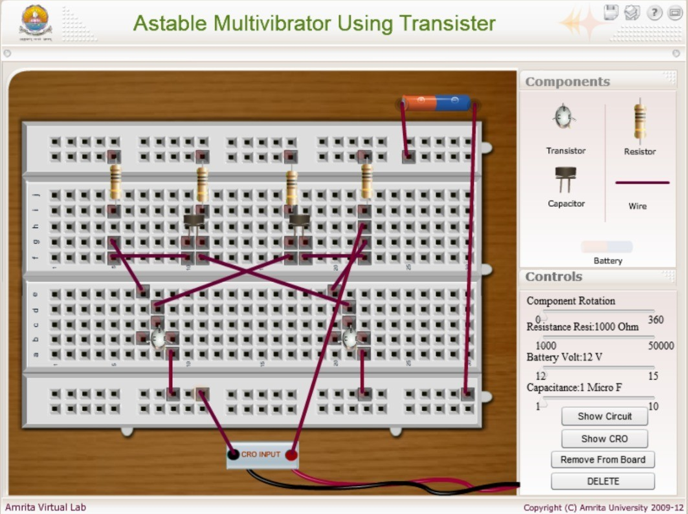

### Apparatus
 

Power supply, Transistors, Resistors, Capacitors, Connection wire and Bread board

<h2>Procedure</h2>

<ol>
  <li>
    Begin by arranging the components on the virtual breadboard as shown in <strong>Animation 1</strong>. Refer to the visual guide carefully to place each component in its correct position.
  </li>

 

  <li>
    To connect the components, click on one end of the wire and then click on the corresponding point on the breadboard to complete the connection. Repeat this step to interconnect all necessary components.
  </li>

  

  
  <li>
    Follow the <strong>connection diagram</strong> to ensure the circuit is completed correctly. Double-check that all connections are made as shown in the schematic.
  </li>
  <li>
    Once the circuit is fully connected, click the <strong>"Show CRO"</strong> button in the simulator interface. This will display the waveform output on the virtual Cathode Ray Oscilloscope (CRO).
  </li>
</ol>

sample circuited connection for astable multivibrator

<h3>To Change the Component Value</h3>

<ol>
  <li>
    Select the component whose value you want to modify by clicking on it within the simulator.
  </li>
  <li>
    Use the slider on the right-hand side of the simulator to adjust the value (e.g., resistance, capacitance) as needed for the experiment.
  </li>
</ol>

