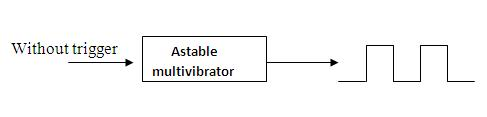
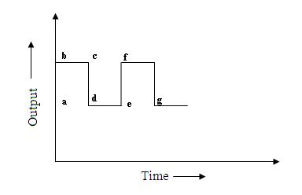

## Theory 

<h2>Theory</h2>

  Multivibrator is considered as a non-sinusoidal oscillator which can generate waveforms other than sine wave.
  They are basically two-stage amplifiers with positive feedback from the output of one amplifier to the input of the other.
  This feedback is supplied in such a manner that one transistor is driven to saturation (ON state) and the other to cut-off (OFF state).
  The action is reversed after a certain time, depending upon the circuit conditions i.e., the saturated transistor is driven into cut-off and the cut-off transistor is driven into saturation.

There are three basic types of multivibrators:

<ol>
  <li>Astable multivibrator</li>
  <li>Monostable multivibrator</li>
  <li>Bistable multivibrator</li>
</ol>

<h3>Astable Multivibrator</h3>

  It is also called free-running relaxation oscillator. It has no stable state but only two quasi-stable states between which it keeps oscillating continuously of its own accord without any external excitation.
  When one transistor is in ON state, the other remains in OFF state. Both will not be in the same state at the same time.

### Circuit Diagram

<h2>Circuit Details</h2>

  The circuit essentially consists of two symmetrical CE amplifier stages, each providing a feedback to another.
  The feedback ratio is unity and positive because of 180° phase shift in each stage.
  Thus collector loads of the two stages are equal i.e. Rc1 = Rc2 and the biasing resistors are also equal i.e. R1 = R2.
  The output of transistor Q1 is coupled to the input of Q2 through C1 while the Q2 is fed to the input of Q1 through C2.
  The square wave output can be taken from Q1 and Q2.
  Because of very strong feedback signal, the transistors are driven either to saturation or to cutoff.

<h2>Operation</h2>

  When Vcc is applied, collector current starts flowing in Q1 and Q2. In addition, the coupling capacitors C1 and C2 also start charging up.
  As the characteristics of no two transistors (β, VBE) are exactly alike, therefore, one transistor, say Q1, will conduct more rapidly than the other.
  The rising collector current in Q1 drives its collector more and more positive. This positive output is applied to the base of transistor Q2 through C1.
  This establishes a reverse bias on Q2 and its collector current starts decreasing.
  As the collector of Q2 is connected to the base of Q1 through C2, therefore the base of Q1 becomes more negative i.e. Q1 is more forward biased.
  This further increases the collector current in Q1 and causes further decrease of collector current in Q2.
  This is repeated until the circuit drives Q1 to saturation and Q2 to cutoff.
  Therefore, full voltage Vcc appears across Rc1 and voltage across Rc2 will be zero.
  The charges developed across C1 and C2 are sufficient to maintain the saturation and cutoff conditions at Q1 and Q2 respectively.
  This condition is represented by time interval ‘bc’ in the figure below.

  However, the capacitor will not retain the charges indefinitely but will discharge through their respective circuits.
  As C1 discharges, the base bias at Q2 becomes less positive and at a time determined by R1 and C1, forward bias is re-established at Q2.
  This causes the collector current to start in Q2.
  The increasing positive potential at the collector of Q2 is applied to the base of Q1 through capacitor C2.
  Hence the base of Q1 will become more positive than Q2. Q2 is quickly driven to saturation.
  This condition is represented by ‘cd’. The period of time during which Q2 remains at saturation and Q1 at cutoff is determined by C2 and R2.

<h2>Switching Time</h2>

The time for which either transistor remains ON or OFF is given by:

<ul>
  <li>ON time for Q1 or OFF time for Q2 is $T_1$  &nbsp;&nbsp;&nbsp;&nbsp;&nbsp;&nbsp;&nbsp;&nbsp;(1)</li>
  <li>OFF time for Q1 or ON time for Q2 is $T_2$ &nbsp;&nbsp;&nbsp;&nbsp;&nbsp;&nbsp;&nbsp;&nbsp;(2)</li>
  <li>Total time period of the square wave is $T=T_1+T_2$ &nbsp;&nbsp;&nbsp;&nbsp;&nbsp;&nbsp;&nbsp;&nbsp;(3)</li>
</ul>

As R1 = R2 = R and C1 = C2 = C:

 T=1.4RC second &nbsp;&nbsp;&nbsp;&nbsp;&nbsp;&nbsp;&nbsp;&nbsp;(4)

  Therefore, the frequency of the square wave is   $f=\frac{1}{T}$
   Note that R is in ohms and C in farads.

<h2>Design</h2>

Here we use transistor BC 107

<h3>Design for Rc1 and Rc2</h3>

$$Rc1=\frac{V_{CC}-VCE_{sat}}{Ic_{sat}}$$

  Here Icsat = 2 mA and VCE = 2.7 V
   Here Rc1 = Rc2

<h3>Design of R1 and R2</h3>

  The resistors R1 and R2 must be able to provide base current enough to keep the transistors in saturation.
   IBmin = IC / hFE
   The actual base current IB = 5 × IBmin

$$R_1=\frac{(V_{cc}-VBE_{sat})}{I_B}$$

  VBE = 0.7 V
   Here R1 = R2 and also C1 = C2

###  Waveforms

